<table align="center" width="100%">
  <tr>
    <td align="center" width="50%">
      <h1>Hi 👋, I'm Sayantan Bharati</h1>
      <h3>A Committed Developer Based in India</h3>
      
    </td>
    <td align="center" width="50%">
      
    </td>

  </tr>
</table>

  

<!-- 

  

 -->

### About Me:

- 🌱 **Main Skills:** MongoDB,NodeJS,ExpressJS,React,JS Vanila.
- ⚓ **Extra Skills:** MySQL,PostgreSQL,Java,Python
- 🤝 **Open To:** Work,Collaborate,Contribute,Team-up.
- 👯 **Looking For:** Opportunities to meet great people and work in exciting projects.

### Welcome to my repositories:

- Here, you'll find a collection of my projects/repositories, ranging from basic to advanced levels.
- Each repository showcases my skills, creativity, and growth/learning process in this journey.
- Feel free to explore.

### Categorization of repositories:

- 🌐 **Lv1_**: _(Basic Frontend projects)_.
- 🖥️ **Lv2_**: _(Basic Fullstack projects)_.
- 💻 **Lv3_**: _(Advanced Fullstack projects)_.
- 🚀 **Lv4_**: _(DSA)_.
- 

### More Categories:

- ⚓ **Ex_**: _(Clg/Extra projects with the help of another project/repo/AI)_.
- ❄️ **SM_**: _(Study Material / Examples)_.
- 🔒 **PV_**: _(Private projects, sensitive work, or non-public content)_.

<table align="center" width="100%">
  <tr>
    <td align="center" width="50%">
       
    </td>
    <td align="center" width="50%">
        
    </td>
  </tr>
</table>

  

### Python Stack

  
  
  
  
  
  
  
  
  
  
  
  
  
  
  
  
  
  
  
  
  
  

 

### MERN Stack

  
  
  
  
  
  
  
  
  
  
  
  
  
  

  <h3>
  Connect With Me:
  </h3>
  
  &nbsp;&nbsp;&nbsp;
  
  &nbsp;&nbsp;&nbsp;
  
  &nbsp;&nbsp;&nbsp;
  

