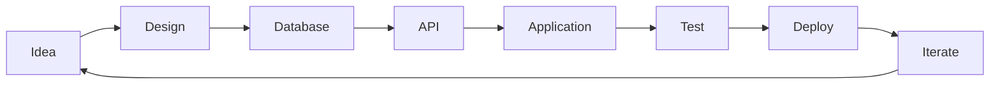

  

<!-- 

  

 
-->

---

<h2 align="center">
   About Me
</h2>

<table>
<tr>
<td colspan="3"></td>
</tr>
<tr>
<td align="center" valign="top" width="33%">

 
<b>Build</b>  
Web Applications 
REST APIs 
Admin Systems 
Developer Tools

</td>
<td align="center" valign="top" width="33%">

 
<b>Work With</b>  
React · Next.js 
Node.js · Express 
PostgreSQL · MongoDB 
Redis · REST

</td>
<td align="center" valign="top" width="33%">

 
<b>Interested In</b>  
Backend Architecture 
Performance 
Authentication 
System Design

</td>
</tr>
</table>

I enjoy taking an idea from <b>database and API design to a working interface and deployment</b>, 
while keeping the underlying systems understandable and maintainable.

---

<h2 align="center">
   Currently
</h2>

<table>
<tr>
<td colspan="4"></td>
</tr>
<tr>
<td align="center" valign="top" width="25%">
   
  <b>Building</b> Full Stack Apps
</td>
<td align="center" valign="top" width="25%">
   
  <b>Exploring</b> Backend Systems
</td>
<td align="center" valign="top" width="25%">
   
  <b>Learning</b> System Design
</td>
<td align="center" valign="top" width="25%">
   
  <b>Improving</b> Performance
</td>
</tr>
</table>

---

<h2 align="center">
   Tech Stack
</h2>

<table>
<tr>
<td colspan="2"></td>
</tr>
<tr>
<th align="center" width="25%">Category</th>
<th align="center" width="75%">Technologies</th>
</tr>

<tr>
<td align="center">
   <b>Languages</b>
</td>
<td align="center">
  
</td>
</tr>

<tr>
<td align="center">
   <b>Frontend</b>
</td>
<td align="center">
   
  
  
</td>
</tr>

<tr>
<td align="center">
   <b>Backend & Auth</b>
</td>
<td align="center">
   
  
  
  
  
  
</td>
</tr>

<tr>
<td align="center">
   <b>Databases & Caching</b>
</td>
<td align="center">
  
</td>
</tr>

<tr>
<td align="center">
   <b>Cloud & Services</b>
</td>
<td align="center">
   
  
  
  
  
  
</td>
</tr>

<tr>
<td align="center">
   <b>Tools</b>
</td>
<td align="center">
  
</td>
</tr>

</table>

---

<h2 align="center">
   Selected Projects
</h2>

<table>
<tr>
<td colspan="3"></td>
</tr>
<tr>

<td width="33%" valign="top" align="center">

<h3 align="center">LnkZoo</h3>
<b>Community Link Discovery</b>  
<code>Next.js</code> <code>PostgreSQL</code> <code>D3.js</code> <code>OpenRouter</code>  
A social platform for discovering, sharing, discussing and ranking links.  
40+ REST API routes 
10-level nested comments 
Feed ranking & leaderboards 
Follow / block, admin analytics 
Canvas physics engine (5–300 particles @ 60 FPS) 
5-thread bulk processing 
JWT + Google OAuth, CSRF, rate limiting  
<a href="https://github.com/Sayantan-B-dev/Lv3_LnkZoo">Repo</a> · <a href="https://lnkzoo.vercel.app">Live</a>

</td>

<td width="33%" valign="top" align="center">

<h3 align="center">BlueEye</h3>
<b>Artist Discovery & Booking</b>  
<code>Next.js</code> <code>MongoDB</code> <code>Redis</code> <code>NextAuth</code>  
A platform for discovering artists, managing events and handling bookings.  
Artist & event management 
Ticketing, reviews, inquiries 
Redis-cached reviews 
Razorpay payments 
JSON-LD SEO, dynamic OG images, ISR 
Automated sitemap, CSV imports 
OTP-protected operations  
<a href="https://github.com/Sayantan-B-dev/Lv3_BlueEye">Repo</a> · <a href="https://blueeyeentertainment.in">Live</a>

</td>

<td width="33%" valign="top" align="center">

<h3 align="center">Re-Docs</h3>
<b>Note Management</b>  
<code>React</code> <code>Node.js</code> <code>Express</code> <code>MongoDB</code>  
A Markdown-based platform for creating, organizing and exporting notes.  
Markdown + KaTeX 
Public / private notes 
Categories + tags 
Document export 
Synchronized editing 
Passport.js, Google OAuth, sessions 
Cloudinary file / image uploads  
<a href="https://github.com/Sayantan-B-dev/Lv3_Re-Docs">Repo</a> · <a href="https://re-docs-pi.vercel.app">Live</a>

</td>

</tr>
</table>

---

<h2 align="center">
   Repository Structure
</h2>

<table>
<tr>
<td colspan="3"></td>
</tr>
<tr>
<th align="center" width="20%">Prefix</th>
<th align="center" width="25%">Category</th>
<th align="center" width="55%">Purpose</th>
</tr>
<tr>
<td align="center"> <code>Lv1_</code></td>
<td align="center"><b>Frontend</b></td>
<td align="center">Basic frontend projects</td>
</tr>
<tr>
<td align="center"> <code>Lv2_</code></td>
<td align="center"><b>Full Stack</b></td>
<td align="center">Basic full-stack projects</td>
</tr>
<tr>
<td align="center"> <code>Lv3_</code></td>
<td align="center"><b>Advanced</b></td>
<td align="center">Advanced full-stack applications</td>
</tr>
<tr>
<td align="center"> <code>Lv4_</code></td>
<td align="center"><b>DSA</b></td>
<td align="center">Data structures & algorithms</td>
</tr>
<tr>
<td align="center"> <code>Ex_</code></td>
<td align="center"><b>Experiments</b></td>
<td align="center">Scripts, automations & side projects</td>
</tr>
<tr>
<td align="center"> <code>SM_</code></td>
<td align="center"><b>Study Material</b></td>
<td align="center">Notes, examples & references</td>
</tr>
<tr>
<td align="center"> <code>PV_</code></td>
<td align="center"><b>Private</b></td>
<td align="center">Private or sensitive projects</td>
</tr>
</table>

The prefix is part of the project name, so you can understand a repository's purpose and complexity before opening it.

---

<h2 align="center">
   Development Flow
</h2>

```mermaid
flowchart LR
    A[Idea] --> B[Design]
    B --> C[Database]
    C --> D[API]
    D --> E[Application]
    E --> F[Test]
    F --> G[Deploy]
    G --> H[Iterate]
    H --> A
```

---

<h2 align="center">
   GitHub Stats
</h2>

  
  

  
  

  

  

---

<h2 align="center">
   A Little Extra
</h2>

  <b>Music Producer & Sound Engineer</b> · 2021 → 2025  
  <code>900+ projects</code> <code>Client work</code> <code>Production</code> <code>Mixing</code> <code>Revisions</code> <code>Delivery</code>

 

**Build  •  Learn  •  Ship**

